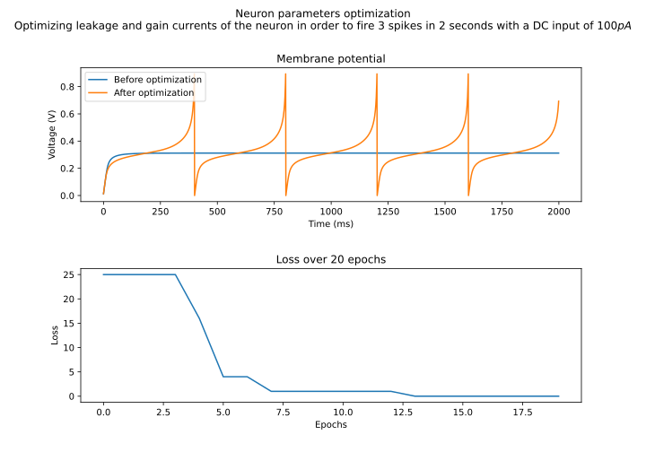

.. _introduction:

Getting start
=============

ARCANA is a library built on PyTorch to provide a simulation model of the DYNAP-SE hardware

Dynap-SE model
Equation
Image

Quickstart
----------
The following code demonstrate how to define a simple neural network in ARCANA. In this example a single neuron is created with and trained the leakage and gain current to have an specific output firing rate.

.. code-block:: python
    :linenos:

    import matplotlib.pyplot as plt
    import numpy as np
    import seaborn as sns
    import torch
    from tqdm import tqdm

    from arcana.model import DPINeuron

    neuron = DPINeuron(
        1,
        1,
        Itau_mem=4e-12,
        Igain_mem=20e-12,
        Ith=0.012,
        Idc=50e-12,
        refP=0.0,
        Ipfb_th=20e-12,
        Ipfb_norm=2e9,
        dt=1e-3,
        train_Igain_mem=True,
        train_Itau_mem=True,
    )

Next, we define the training and test function. The training function will receive the neuron, optimizer and the number of epochs to train. To calculate the loss, the mean squared error of the number of output spikes will be used.

.. code-block:: python
    :linenos:

    def train(neuron, optimizer, epochs):
        loss_hist = []
        Itau_hist = []
        Igain_hist = []
        Vmem_hist = []
        neuron.train()
        pbar = tqdm(range(epochs))
        for _ in pbar:
            outAcum = 0.0
            state = None
            totalVmem = []
            for t in range(2000):
                out, state = neuron(torch.zeros(1, 1), state)
                (Imem, _, _, _, _, _) = state
                outAcum += out

                totalVmem.append(neuron.I2V(Imem).detach().numpy().item())
            totalVmem = np.stack(totalVmem)

            loss = (outAcum.sum() - torch.tensor(5.0)) ** 2
            optimizer.zero_grad()
            loss.backward()
            optimizer.step()
            loss_hist.append(loss.item())
            with torch.no_grad():
                Vmem_hist.append(totalVmem)
                Itau_hist.append(neuron.Itau_mem.numpy().item())
                Igain_hist.append(neuron.Igain_mem.numpy().item())
            pbar.set_postfix({"Loss": loss.item()})
        return loss_hist, Vmem_hist, Itau_hist, Igain_hist

.. code-block:: python
    :linenos:

    @torch.no_grad()
    def test(neuron):
        state = None
        totalImem = []
        totalVmem = []
        neuron.eval()
        for t in tqdm(range(2000)):
            out, state = neuron(torch.zeros(1, 1), state)
            (Imem, Iampa, _, _, _, _) = state
            totalImem.append(Imem.numpy().item())
            totalVmem.append(neuron.I2V(Imem).numpy().item())
        return totalImem, totalVmem

Next, we create the optimizer to train the network. In this case is the Adam optimizer with a learning rate of 5e-3.

.. code-block:: python
    :linenos:

    optimizer = torch.optim.Adam(neuron.parameters(), lr=5e-3)
    optimizer.register_step_post_hook(neuron.UpdateParams)
    print(optimizer)

Finally we train the network for 20 epochs, and we see difference of the model behaviour before and after training.

.. code-block:: python
    :linenos:

    epochs = 20
    Imem_pre, Vmem_pre = test(neuron)
    (loss, _, Itau, Igain) = train(neuron, optimizer, epochs)
    Imem_post, Vmem_post = test(neuron)

